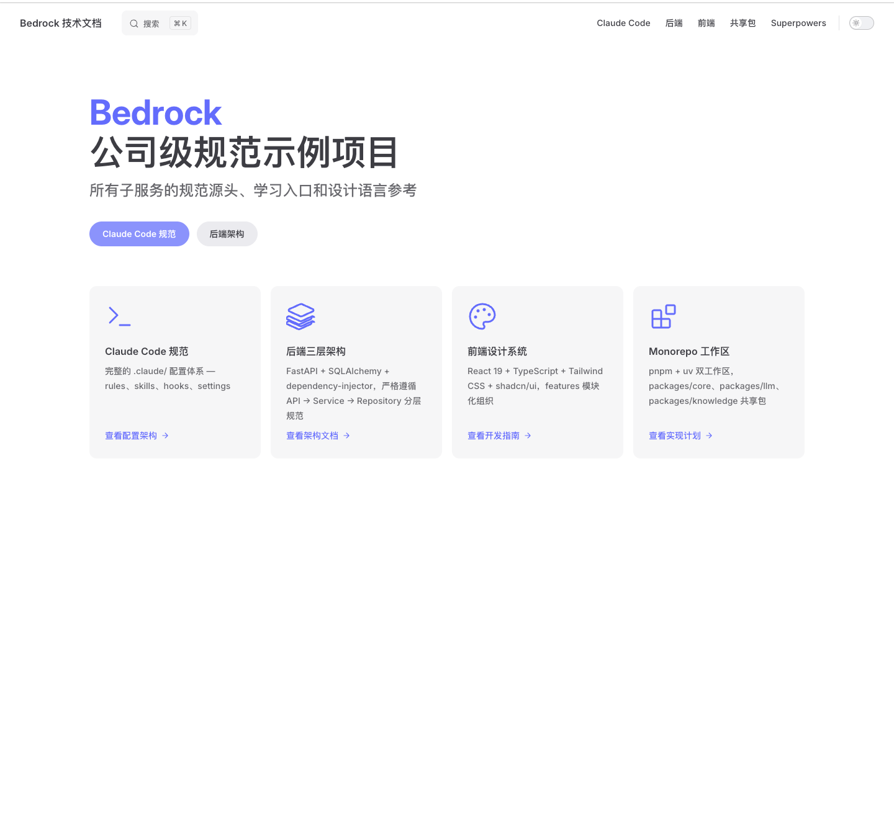
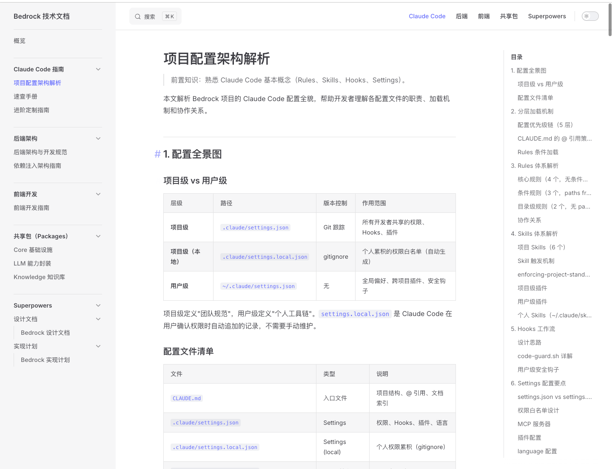

# circle-talk


## 项目结构

```
bedrock/
├── apps/
│   ├── backend/                # FastAPI Python 后端 (8000)
│   │   └── src/backend/
│   │       ├── main.py         # 启动 + 路由注册
│   │       ├── container.py    # DI 容器
│   │       ├── common/         # 通用工具（error_handler / pagination / response）
│   │       └── domain/         # 业务域
│   │           ├── api/        # API 端点
│   │           ├── model/      # ORM 模型
│   │           ├── repository/ # 数据访问
│   │           ├── schema/     # Pydantic Schema
│   │           └── service/    # 业务逻辑
│   └── frontend/               # React TypeScript 前端 (5173)
│       └── src/
│           ├── app/            # layouts / providers / routes
│           ├── features/       # 按业务划分（user/ 为示例）
│           ├── shared/         # hooks / lib / types
│           └── styles/         # 设计 token
├── packages/
│   ├── core/                   # 共享基础设施（13 模块）
│   ├── llm/                    # LLM 能力封装
│   └── knowledge/              # 知识库
├── docs/                       # 技术文档（VitePress）
└── .claude/                    # Claude Code 规范体系
```

## 技术栈

| 层 | 技术 |
|----|------|
| 后端 | Python 3.13+, FastAPI, SQLAlchemy 2.0 (async), dependency-injector, Alembic |
| 前端 | React 19, TypeScript 5.9, Vite, Tailwind CSS 4.x, shadcn/ui, TanStack Query |
| 数据库 | PostgreSQL (多租户 Schema 隔离), Redis, pgvector |
| 存储 | MinIO (S3 兼容) |
| AI | LangChain, LangGraph, 多供应商 LLM (OpenAI / DashScope / Ollama) |
| 工具链 | pnpm (前端), uv (Python), Ruff, Pyright, ESLint |

## 快速启动

```bash
# 后端
cd apps/backend && python -m uvicorn backend.main:app --reload --port 8000

# 前端
pnpm --filter @bedrock/frontend dev

# 全栈
pnpm dev
```

## 后端架构

三层分层：**API → Service → Repository**

- **API**: `@inject` + `Depends(Provide["..."])` 注入 Service；`Depends(db_session)` 获取 Session
- **Service**: 构造器注入依赖；首参 `session: AsyncSession`；写操作调用 `flush()`
- **Repository**: Singleton 无状态；显式接收 `session`；不创建 Session、不 commit

## 前端架构

- `features/` 按业务组织（components / hooks / api / types）
- `shared/` 全局共享（hooks / lib / types）
- `styles/` 设计系统（CSS 变量 / 设计 token）

## 技术文档

项目使用 [VitePress](https://vitepress.dev/) 构建技术文档站点，覆盖后端架构、前端开发、共享包、Claude Code 规范等内容。

### 启动文档站点

```bash
pnpm --filter docs dev
```

访问 `http://localhost:5173` 查看文档。

### 文档预览

**首页** — 项目总览与快速导航：



**文档页** — 左侧导航 + 右侧目录 + 全文搜索：



### 文档目录

| 分类 | 文档 | 说明 |
|------|------|------|
| 后端 | [后端架构与开发规范](docs/backend/architecture.md) | 三层分层、DI、Session 策略 |
| 后端 | [依赖注入架构指南](docs/backend/dependency-injection.md) | AppContainer 设计与陷阱 |
| 前端 | [前端开发指南](docs/frontend/development.md) | 技术栈、组件规范、API 模式 |
| 共享包 | [Core 基础设施](docs/packages/core.md) | 13 个基础模块总览 |
| 共享包 | [LLM 能力封装](docs/packages/llm.md) | 多供应商路由、向量检索 |
| 共享包 | [Knowledge 知识库](docs/packages/knowledge.md) | 领域模型、异常体系 |
| Claude Code | [项目配置架构解析](docs/claude/architecture.md) | Rules / Skills / Hooks / Settings |
| Claude Code | [速查手册](docs/claude/cheatsheet.md) | 日常开发快速查阅 |
| Claude Code | [进阶定制指南](docs/claude/customization.md) | 新增 Rule / Skill / Hook 方法 |
