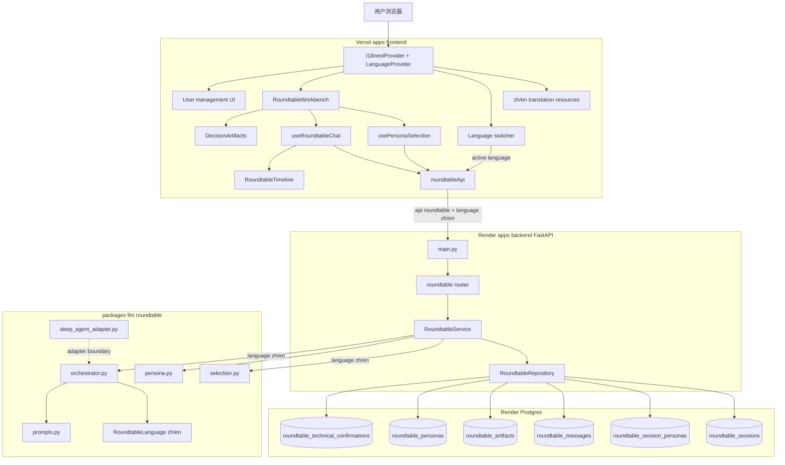
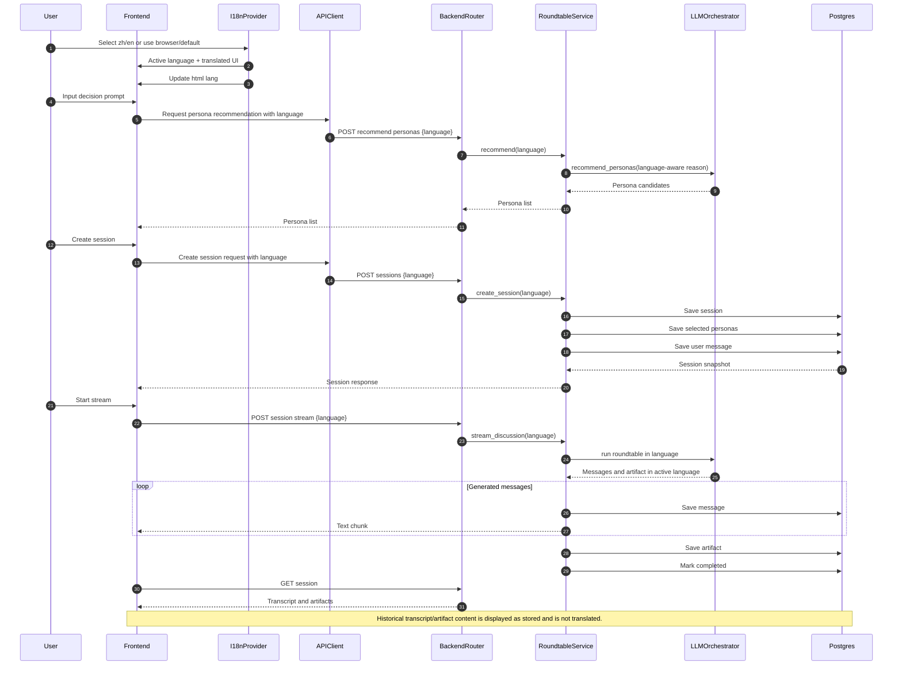
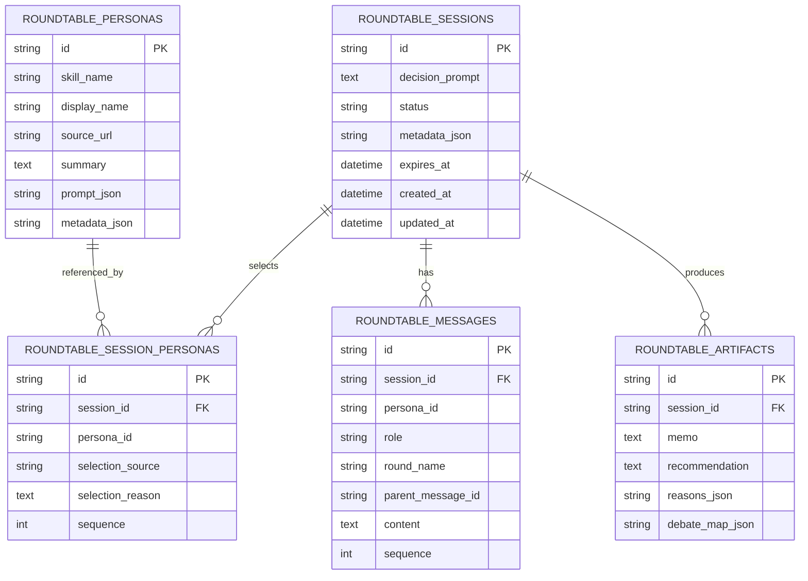

# 圆桌对话项目架构图与实现位置

基于 `.omx/plans/roundtable-tech-confirmation.md` 的确认：首版目标是“决策题 -> 人物推荐/手选 -> Opening/Rebuttal/Closing 多轮圆桌 -> 主持人三件套 -> follow-up”，技术栈为 Vite React + AI SDK Text Stream、FastAPI + `packages/llm` roundtable orchestration、DeepAgents adapter、Postgres 持久化。

## 1. 总体架构图

## 2. 端到端调用链

## 3. 技术栈实现位置

| 技术/能力 | 当前状态 | 实现位置 |
| --- | --- | --- |
| Vite React 前端 | 已实现圆桌工作台页面和组件 | `apps/frontend/src/features/roundtable/components/RoundtableWorkbench.tsx`、`DecisionPromptForm.tsx`、`PersonaPicker.tsx`、`RoundtableTimeline.tsx`、`DecisionArtifacts.tsx` |
| 全应用 i18n | 需新增 `i18next + react-i18next`；统一既有中英文混杂文案，语言优先级为显式选择 > API 参数 > 浏览器语言 > 默认 `zh` | `apps/frontend/src/app/i18n/`、`apps/frontend/src/app/layouts/AppLayout.tsx`、各 feature 组件 |
| HTML language | 需随 active language 同步 `document.documentElement.lang` | 前端 i18n provider/effect |
| 前端 API client | 已实现 `/api/roundtable/*` 封装和本地 mock fallback | `apps/frontend/src/features/roundtable/api/roundtableApi.ts` |
| Roundtable language parameter | 需在 recommend/create/stream/follow-up 请求中传递 `language: "zh" | "en"`；省略时后端默认 `zh` 保持兼容 | 前端：`roundtableApi.ts`、`useRoundtableChat.ts`；后端：`roundtable_schema.py`、`roundtable.py`、`roundtable_service.py` |
| AI SDK Text Stream | 依赖已安装；当前源码按 Text Stream/raw text 方式用 `fetch` + `ReadableStream` 消费，未实际 import `@ai-sdk/react` 的 `useChat` | 依赖：`apps/frontend/package.json` 的 `@ai-sdk/react` 与 `ai`；消费实现：`apps/frontend/src/features/roundtable/hooks/useRoundtableChat.ts` 的 `AI_SDK_TEXT_STREAM_PROTOCOL = 'text'`、`consumeTextStream()` |
| 前端会话恢复 | 已通过 URL query `session` 恢复 | `apps/frontend/src/features/roundtable/hooks/useRoundtableChat.ts`、`RoundtableWorkbench.tsx` |
| 人物加载/推荐/手选 | 已实现前端状态和后端推荐接口调用 | 前端：`apps/frontend/src/features/roundtable/hooks/usePersonaSelection.ts`；后端：`apps/backend/src/backend/domain/api/roundtable.py` |
| FastAPI API | 已实现 personas、session、stream、follow-up 路由 | `apps/backend/src/backend/domain/api/roundtable.py`；路由注册在 `apps/backend/src/backend/main.py` |
| Streaming transport | 已实现 POST streaming，返回 `text/plain; charset=utf-8` | `apps/backend/src/backend/domain/api/roundtable.py` 的 `stream_session()`、`stream_follow_up()` |
| 业务服务层 | 已实现 seed persona、创建/恢复 session、流式讨论、追问、取消状态 | `apps/backend/src/backend/domain/service/roundtable_service.py` |
| 数据库持久化 | 已实现 session、selected personas、messages、artifacts、technical confirmations 的 ORM 和 migration | ORM：`apps/backend/src/backend/domain/model/roundtable.py`；Repository：`apps/backend/src/backend/domain/repository/roundtable_repository.py`；Migration：`apps/backend/alembic/versions/20260512_0001_roundtable_tables.py` |
| `packages/llm` roundtable domain | 已实现 persona catalog、选择规则、多轮编排、三件套 schema | `packages/llm/src/llm/roundtable/` |
| Roundtable 生成语言 | 需让 LLM prompt 与 deterministic fallback 按 `zh/en` 生成新内容；历史内容不翻译 | `packages/llm/src/llm/roundtable/llm_client.py`、`orchestrator.py`、`selection.py` |
| `zhuzi-skill` 多轮规则参考 | 已产品化为 Opening/Rebuttal/Closing + synthesis prompt 常量 | `packages/llm/src/llm/roundtable/prompts.py`、`orchestrator.py` |
| `nuwa-skill` persona source | 已转成项目内 persona metadata，但当前候选池与技术确认文档里的 Jobs/PG/张一鸣等不完全一致 | `packages/llm/src/llm/roundtable/persona.py` |
| DeepAgents | 依赖和 adapter boundary 已有；当前 `RoundtableService` 默认仍直接使用 `RoundtableOrchestrator`，DeepAgents adapter 未接到线上调用链 | 依赖：`packages/llm/pyproject.toml`；adapter：`packages/llm/src/llm/roundtable/deep_agent_adapter.py`；测试：`packages/llm/tests/roundtable/test_roundtable_policy.py` |
| Render Postgres / Render backend | 已有 Render blueprint，包含 Postgres、Docker backend、health check、migration preDeploy | `render.yaml`、`apps/backend/Dockerfile`、`apps/backend/alembic.ini` |
| 本地 `/api` proxy | Vite dev server 已把 `/api` 代理到后端 `localhost:8000` | `apps/frontend/vite.config.ts` |

## 4. AI SDK 具体在哪里用

当前仓库里 AI SDK 是“依赖已纳入 + Text Stream 协议形态已按 raw text 消费”，不是“已经用 `@ai-sdk/react` hook 接管聊天状态”。

- 依赖位置：`apps/frontend/package.json`
  - `@ai-sdk/react`
  - `ai`
- 协议标记：`apps/frontend/src/features/roundtable/hooks/useRoundtableChat.ts`
  - `AI_SDK_TEXT_STREAM_PROTOCOL = 'text'`
- 流消费位置：`apps/frontend/src/features/roundtable/hooks/useRoundtableChat.ts`
  - `consumeTextStream()` 使用 `fetch(..., { method: 'POST' })`
  - 从 `response.body.getReader()` 读取 chunk
  - 用 `TextDecoder` 拼接到 `streamText`
- 后端输出位置：`apps/backend/src/backend/domain/api/roundtable.py`
  - `StreamingResponse(body(), media_type="text/plain; charset=utf-8")`

结论：首版“Text Stream”路径已经可运行，但如果要严格落成 AI SDK UI hook，需要把 `useRoundtableChat.ts` 改为 `@ai-sdk/react`/`ai` 的对应 hook 或 stream helper，并确认后端响应格式完全匹配目标 AI SDK Stream Protocol。

## 5. DeepAgents 具体在哪里用

当前 DeepAgents 是“包依赖 + adapter 边界 + import/status 检查”，尚未成为 `RoundtableService` 的默认编排器。

- 依赖位置：`packages/llm/pyproject.toml`
  - `deepagents>=0.2`
- adapter 位置：`packages/llm/src/llm/roundtable/deep_agent_adapter.py`
  - `deepagents_status()` 尝试 `import deepagents`
  - `DeepAgentRoundtableAdapter.run()` 保持 request-scoped，并回退到 `RoundtableOrchestrator`
  - `RoundtableDeepAgentAdapter` 是兼容别名
- 测试位置：`packages/llm/tests/roundtable/test_roundtable_policy.py`
  - 覆盖 `RoundtableDeepAgentAdapter().run(...)`
- 当前后端实际调用：`apps/backend/src/backend/domain/service/roundtable_service.py`
  - `RoundtableService.__init__()` 默认创建 `RoundtableOrchestrator()`
  - `stream_discussion()` 调用 `self._orchestrator.run(...)`

结论：DeepAgents 的隔离边界已经放在 `packages/llm`，符合“backend 通过 bedrock-llm 调用，不直接依赖 deepagents”的方向；但实际线上调用链还没有把 `DeepAgentRoundtableAdapter` 注入到 `RoundtableService`。

## 6. 数据模型落点

多语言首版不要求迁移历史数据，也不要求新增 session/artifact language 字段。语言由新请求显式传入生成链路；已持久化的 transcript/artifacts 按原文展示。

实现文件：

- ORM：`apps/backend/src/backend/domain/model/roundtable.py`
- migration：`apps/backend/alembic/versions/20260512_0001_roundtable_tables.py`
- CRUD：`apps/backend/src/backend/domain/repository/roundtable_repository.py`
- API schema：`apps/backend/src/backend/domain/schema/roundtable_schema.py`

## 7. 当前实现与技术确认的差距

| 技术确认项 | 当前仓库情况 | 建议下一步 |
| --- | --- | --- |
| AI SDK 首版优先 Text Stream | 已以 raw text stream 方式实现；AI SDK 依赖存在但 hook 未实际使用 | 明确是否接受 raw `fetch` Text Stream；若不接受，改为 AI SDK 官方 hook/helper |
| DeepAgents 首版作为同步/流式 orchestration layer | adapter 存在，但后端默认没走 adapter | 在 DI 容器或 service 构造中注入 `DeepAgentRoundtableAdapter`，并保留 fallback/status 错误 |
| Persona seed 使用确认文档的 Jobs/PG/张一鸣等 | 当前实现是曾国藩、苏格拉底、德鲁克、芒格、西蒙娜·薇依 | 替换或扩展 `persona.py` 的 `_DEFAULT_PERSONAS`，保持确认文档候选池一致 |
| 持久化 technical confirmation metadata | 表已建，但当前 repository/service 未写入确认记录 | 增加写入/读取 `roundtable_technical_confirmations` 的 repository 方法 |
| SSE/AI SDK stream smoke test | 测试清单有要求；当前需要继续确认测试覆盖 | 补充前后端 streaming smoke 或 API test |
