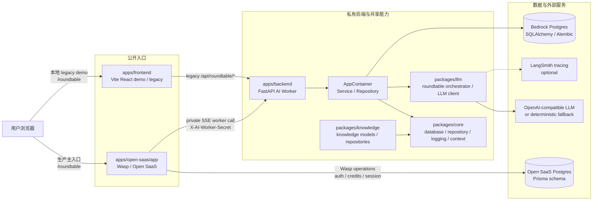
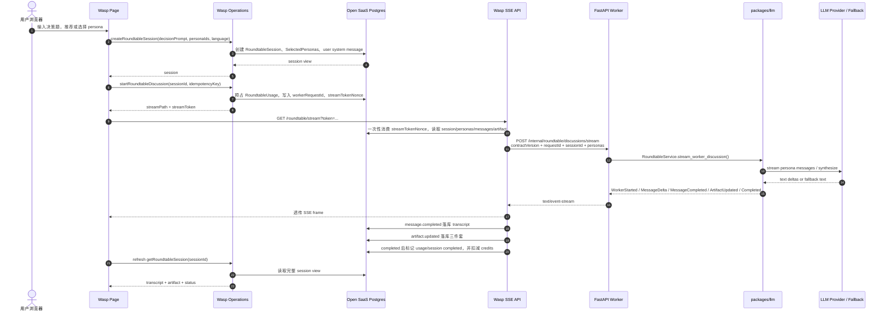
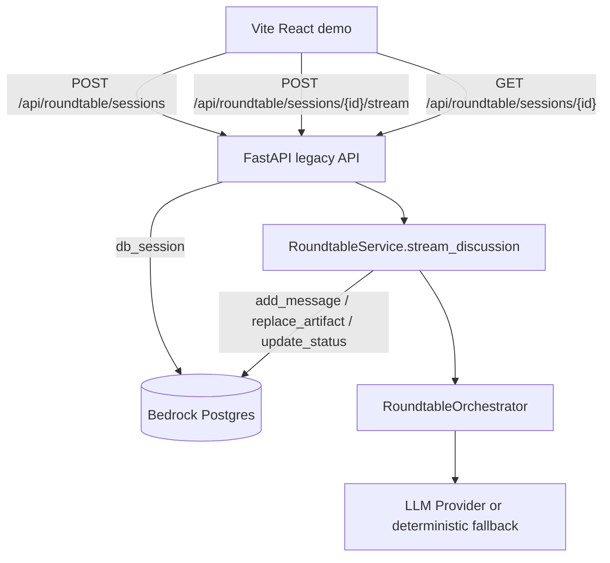

# 架构图、数据流与日志排查

本文用于快速回答三个问题：

- Bedrock / CircleTalk 当前有哪些运行时组件。
- 圆桌对话从创建 session 到流式生成、落库、恢复的主数据流是什么。
- 线上或本地出问题时，应该按什么顺序看日志、表状态和请求链路。

## 系统架构图



### 组件边界

| 组件 | 职责 | 关键文件 |
| --- | --- | --- |
| Wasp / Open SaaS | 生产用户入口；鉴权、额度预占、session 查询、SSE 代理与持久化 | `apps/open-saas/app/src/roundtable/server/operations.ts`、`apps/open-saas/app/src/roundtable/server/streamApi.ts` |
| FastAPI AI Worker | 私有圆桌 worker；校验共享密钥，执行 persona 推荐、讨论流、追问流 | `apps/backend/src/backend/domain/api/roundtable_worker.py` |
| Legacy Vite demo | 本地演示入口；可直连 legacy FastAPI `/api/roundtable/*` | `apps/frontend/src/features/roundtable/api/roundtableApi.ts` |
| Roundtable Service | 连接 API、Repository、LLM orchestrator；负责状态流转与数据映射 | `apps/backend/src/backend/domain/service/roundtable_service.py` |
| LLM roundtable | 人物选择、Opening / Rebuttal / Closing / Synthesis 编排；无 key 时 fallback | `packages/llm/src/llm/roundtable/orchestrator.py`、`packages/llm/src/llm/roundtable/llm_client.py` |
| Core | 多租户数据库、Repository 基类、请求上下文、日志基础设施 | `packages/core/src/core/` |

## 圆桌数据流程图



### 追问流差异

追问复用同一个 `/roundtable/stream` 代理入口，但 `RoundtableUsage.operation` 为 `follow_up`。Wasp 从 `usage.metadataJson` 取 `question/language`，调用 worker 的 `/internal/roundtable/follow-up/stream`，并把已有 transcript、selected personas、artifact 一起传给 worker。

### Legacy Vite 数据流



生产入口不应依赖 legacy Vite demo；`apps/frontend` 主要用于本地演示和接口兼容验证。

## 日志记载口径

### 关联 ID

| 字段 | 产生位置 | 用途 |
| --- | --- | --- |
| `sessionId` | Wasp `createRoundtableSession` 或 FastAPI legacy `create_session` | 贯穿页面恢复、transcript、artifact、usage |
| `usage.id` | Wasp `reservePendingUsage` | 一次讨论或追问的计费与状态记录 |
| `workerRequestId` | Wasp `reservePendingUsage` | Wasp 调 worker 的请求关联 ID；worker SSE event 中的 `requestId` |
| `streamTokenNonce` | Wasp `issueStreamTokenOrThrow` | 防止 stream token 重放；被 `/roundtable/stream` 一次性消费 |
| `request_id` | FastAPI middleware / Core logging filter | FastAPI 请求日志关联字段；不同于 worker `requestId` |

排查时优先从浏览器 URL 或数据库拿到 `sessionId`，再沿 `RoundtableUsage.workerRequestId` 关联 worker 事件。

### 日志位置

| 环境 | 主要日志 |
| --- | --- |
| Wasp 本地 | `wasp start` 所在终端输出，重点看 Wasp operation、`/roundtable/stream`、Prisma 错误 |
| Wasp 生产 | 部署平台的 web app logs，按 `sessionId`、`usage.id`、`workerRequestId` 搜索 |
| FastAPI 本地 | `uvicorn backend.main:app ...` 所在终端输出；请求日志包含方法、路径、状态码、耗时 |
| FastAPI 文件日志 | 只有入口调用 `core.logging.configure_logging()` 时才会写入 `LOG_DIR`，默认文件名为 `application.log`、`error.log`、`sql.log` |
| LLM 链路 | Roundtable LLM 调用失败会在 worker 日志中出现 fallback 记录；启用 LangSmith 时再看 trace |

## 排查流程

### 1. 先判断入口

| 现象 | 先看哪里 |
| --- | --- |
| `http://localhost:3000/roundtable` 或生产站点异常 | Wasp 页面、Wasp operations、`/roundtable/stream` |
| `http://localhost:5173/roundtable` 异常 | Legacy Vite demo 与 FastAPI `/api/roundtable/*` |
| `/internal/roundtable/*` 直接 401 | `AI_WORKER_SHARED_SECRET` 与 `X-AI-Worker-Secret` |
| 页面可创建 session，但 stream 失败 | Wasp `RoundtableUsage`、stream token、worker status、SSE 终止事件 |

### 2. 浏览器侧

1. 打开 DevTools Network。
2. 生产主入口检查 Wasp operations 是否成功返回 session，以及 `GET /roundtable/stream?token=...` 是否为 200。
3. Legacy demo 检查 `/api/roundtable/sessions` 与 `/api/roundtable/sessions/{id}/stream`。
4. 如果 stream 返回 200 但 UI 不更新，检查 SSE frame 是否包含 `roundtable.worker.v1.message.completed`、`artifact.updated`、`completed`。
5. 记录 `sessionId`，继续查数据库和日志。

### 3. Wasp / Open SaaS 服务端

按 `sessionId` 查询：

```sql
select id, status, "decisionPrompt", "createdAt", "updatedAt"
from "RoundtableSession"
where id = '<sessionId>';

select id, operation, status, "workerRequestId", "errorMessage", "reservedAt", "completedAt", "cancelledAt", "errorAt"
from "RoundtableUsage"
where "sessionId" = '<sessionId>'
order by "createdAt" desc;
```

判断规则：

| 状态 | 含义 | 下一步 |
| --- | --- | --- |
| usage `reserved` 且 `streamTokenNonce` 非空 | 已预占，但浏览器还没消费 stream token | 检查前端是否真正请求 `/roundtable/stream` |
| usage `reserved` 且 `streamTokenNonce` 为空 | stream 已开始，但未收到终止事件 | 查 Wasp SSE API 与 worker 日志 |
| usage `error` | Wasp 或 worker 已记录错误 | 看 `errorMessage`，再用 `workerRequestId` 查 worker |
| session `completed` 但页面为空 | 后端已完成，前端刷新/渲染异常 | 查 `RoundtableMessage`、`RoundtableArtifact` 与浏览器 console |

### 4. FastAPI Worker

检查：

```bash
curl "$AI_WORKER_URL/health"
curl -H "X-AI-Worker-Secret: $AI_WORKER_SHARED_SECRET" "$AI_WORKER_URL/internal/roundtable/status"
```

重点看：

- worker 是否能被 Wasp 网络访问。
- `AI_WORKER_SHARED_SECRET` 是否与 Wasp 完全一致。
- `ENABLE_LEGACY_ROUNDTABLE_API` 在生产是否关闭，避免误把 legacy API 当生产入口。
- `ROUNDTABLE_LLM_ENABLED=true` 时，`ROUNDTABLE_LLM_MODEL` 与 `ROUNDTABLE_LLM_API_KEY` / `OPENAI_API_KEY` 是否完整。
- 没有 LLM key 时，worker 会走 deterministic fallback；这不是错误，但生成质量与真实 LLM 不同。

### 5. SSE 合同

Wasp 与 worker 使用 `roundtable.worker.v1` 合同。排查 stream 时检查事件序列：

```text
roundtable.worker.v1.started
roundtable.worker.v1.message.delta
roundtable.worker.v1.message.completed
roundtable.worker.v1.artifact.updated
roundtable.worker.v1.completed
```

异常路径应返回：

```text
roundtable.worker.v1.error
```

如果 Wasp 报 `stream ended without a terminal event`，说明 worker stream 结束前没有发出 `completed` 或 `error`。此时优先查 worker 异常、网络中断、反向代理超时。

### 6. 常见问题速查

| 问题 | 可能原因 | 处理 |
| --- | --- | --- |
| `/internal/roundtable/*` 401 | worker secret 缺失或不一致 | 同步 Wasp 与 Worker 的 `AI_WORKER_SHARED_SECRET` |
| `/roundtable/stream` 401 | stream token 缺失、过期、nonce 已消费 | 重新调用 start discussion / follow-up，避免复用旧 URL |
| usage 长时间 `reserved` | 浏览器中断、worker 无终止事件、代理超时 | 查 `streamTokenNonce`、Wasp stream logs、worker SSE 事件 |
| 页面有 delta 但刷新后无记录 | 只有 `message.completed` 才会落库 | 检查 worker 是否发出 completed frame |
| 三件套缺失 | worker 没发 `artifact.updated` 或 Wasp 持久化失败 | 查 worker artifact event 与 Prisma 写入错误 |
| LLM 返回慢或失败 | provider 超时、key/model/base_url 错误 | 查 worker 日志；必要时临时关闭 `ROUNDTABLE_LLM_ENABLED` 验证 fallback |
| 本地 Vite 有 mock 数据 | legacy API 不可用时会 fallback | 确认是否真的请求到 FastAPI，而不是 mock session |

## 最小复现脚本

生产主链路优先从 Wasp 页面复现；worker 可单独用健康检查验证。Legacy FastAPI 可用以下方式快速验证：

```bash
curl http://localhost:8000/health

curl -X POST "http://localhost:8000/api/roundtable/sessions" \
  -H "Content-Type: application/json" \
  -d '{"decisionPrompt":"是否应该推进新产品试点？","language":"zh","personaIds":[]}'

curl -N -X POST "http://localhost:8000/api/roundtable/sessions/<sessionId>/stream" \
  -H "Content-Type: application/json" \
  -d '{"language":"zh"}'
```

如果只需要验证 worker 合同：

```bash
curl -H "X-AI-Worker-Secret: $AI_WORKER_SHARED_SECRET" \
  "$AI_WORKER_URL/internal/roundtable/status"
```
